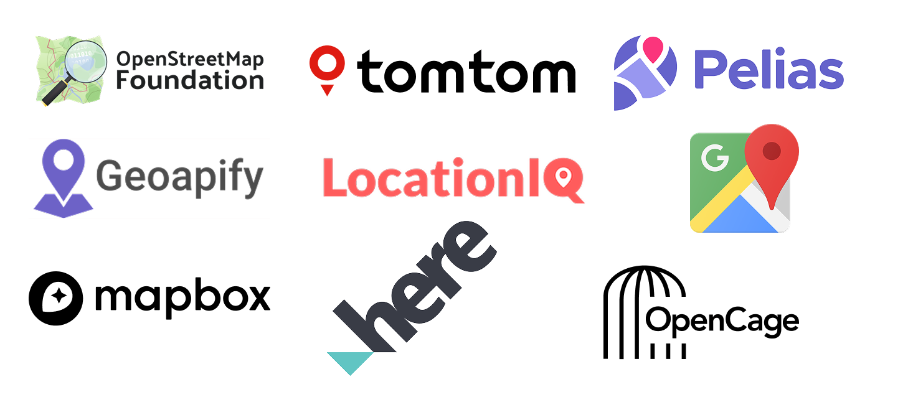

<h1 align="center">
  react-native-places-autocomplete
</h1>

A provider-agnostic React Native autocomplete component for searching addresses and places. Supports multiple **built-in geocoding providers** including OpenStreetMap (free), OpenCage, Google Places, Mapbox, LocationIQ, Geoapify, HERE, and TomTom, or use any custom API. Easy to integrate, fully customizable, and lightweight.

<p align="center">
  <a href="https://www.npmjs.com/package/@julekgwa/react-native-places-autocomplete">
    
  </a>
  <a href="https://www.npmjs.com/package/@julekgwa/react-native-places-autocomplete">
    
  </a>
  <a href="https://github.com/julekgwa/react-native-places-autocomplete/blob/main/LICENSE">
    
  </a>
  <a href="https://github.com/julekgwa/react-native-places-autocomplete">
    
  </a>
</p>

<p align="center">
  
</p>

<p align="center">
  <a href="https://snack.expo.dev/@lekgwaraj/react-native-places-autocomplete">
    
  </a>
</p>

## ✨ Features

- 🌍 **Built-in Providers** - OpenStreetMap (free), OpenCage, Google Places, Mapbox, LocationIQ, Geoapify, HERE, TomTom
- 🔧 **Provider Agnostic** - Works with any geocoding API or use built-in providers
- 🎨 **Fully Customizable** - Complete theme and styling control
- 📱 **React Native + Web Ready** - Built specifically for React Native apps
- 🔍 **Recent Searches** - Built-in recent searches functionality
- ⚡ **Debounced Requests** - Optimized API calls with configurable debouncing
- 🎯 **TypeScript Support** - Full TypeScript support with type definitions
- 📦 **Lightweight** - Minimal dependencies
- 🔤 **Query Options** - Customize API requests with provider-specific parameters

## 📦 Installation

```bash
npm install @julekgwa/react-native-places-autocomplete
```

### Additional Setup

Since the component uses SVG icons, you'll need to install `react-native-svg`:

For Expo projects:
```bash
expo install react-native-svg
```

For bare React Native projects, follow the [react-native-svg installation guide](https://github.com/software-mansion/react-native-svg#installation).

## 🚀 Quick Start

### Using Built-in Providers (Recommended)

The easiest way to get started is using one of the built-in providers:

```typescript
import React from 'react';
import { LocationAutocomplete } from '@julekgwa/react-native-places-autocomplete';
import type { LocationSuggestion } from '@julekgwa/react-native-places-autocomplete';

const App = () => {
  const handleLocationSelect = (location: LocationSuggestion) => {
    console.log('Selected:', location);
  };

  return (
    <LocationAutocomplete
      // Use OpenStreetMap (completely free, no API key required)
      provider="openstreetmap"
      queryOptions={{
        countrycodes: "us,ca,gb", // Limit to specific countries
        limit: 8
      }}
      placeholder="Search for a location..."
      onLocationSelect={handleLocationSelect}
      showRecentSearches={true}
    />
  );
};
```

### Using Built-in Providers with API Keys

```typescript
// Mapbox example
<LocationAutocomplete
  provider="mapbox"
  providerConfig={{
    apiKey: "YOUR_MAPBOX_TOKEN"
  }}
  queryOptions={{
    country: "us",
    types: "place,address"
  }}
  onLocationSelect={handleLocationSelect}
/>

// Google Places example
<LocationAutocomplete
  provider="google"
  providerConfig={{
    apiKey: "YOUR_GOOGLE_API_KEY"
  }}
  queryOptions={{
    components: "country:us",
    types: "geocode"
  }}
  onLocationSelect={handleLocationSelect}
/>
```

### Using Custom API

```typescript
const App = () => {
  const fetchSuggestions = async (query: string): Promise<LocationSuggestion[]> => {
    // Your API implementation here
    const response = await fetch(`https://your-api.com/search?q=${query}`);
    const data = await response.json();

    // Transform your API response to match LocationSuggestion interface
    return data.results.map(item => ({
      place_id: item.id,
      display_name: item.name,
      lat: item.latitude.toString(),
      lon: item.longitude.toString(),
      type: item.type,
      importance: item.relevance || 0.5
    }));
  };

  const handleLocationSelect = (location: LocationSuggestion) => {
    console.log('Selected:', location);
  };

  return (
    <LocationAutocomplete
      placeholder="Search for a location..."
      fetchSuggestions={fetchSuggestions}
      onLocationSelect={handleLocationSelect}
      showRecentSearches={true}
    />
  );
};
```

## 🌐 Built-in Providers

The library includes built-in support for popular geocoding providers. Simply specify the `provider` prop and optional configuration:

**⚠️ Important: All providers require proper attribution. See the [Attribution Requirements](#attribution-requirements) section below.**

### OpenStreetMap (Free)
No API key required! Perfect for getting started or apps with basic location needs.

**Attribution Required**: Must credit OpenStreetMap and link to the ODbL license.

```typescript
import React from 'react';
import { Text, Linking } from 'react-native';

const OpenStreetMapAttribution = () => (
  <Text style={{ padding: 8, fontSize: 10, color: '#666', textAlign: 'center' }}>
    Map data from{' '}
    <Text
      style={{ color: '#007AFF', textDecorationLine: 'underline' }}
      onPress={() => Linking.openURL('https://www.openstreetmap.org/copyright')}
    >
      OpenStreetMap
    </Text>
  </Text>
);

<LocationAutocomplete
  provider="openstreetmap"
  queryOptions={{
    countrycodes: "us,ca", // Optional: limit to countries
    addressdetails: 1,     // Optional: include address details
    limit: 10             // Optional: max results (default: 10)
  }}
  attribution={<OpenStreetMapAttribution />}
  onLocationSelect={handleSelect}
/>
```

### OpenCage
Requires API key. Reliable geocoding with worldwide coverage and good documentation.

**Attribution Required**: Must credit OpenCage and underlying data sources.

```typescript
const OpenCageAttribution = () => (
  <Text style={{ padding: 8, fontSize: 10, color: '#666', textAlign: 'center' }}>
    © OpenCage | © OpenStreetMap contributors
  </Text>
);

<LocationAutocomplete
  provider="opencage"
  providerConfig={{
    apiKey: "YOUR_OPENCAGE_API_KEY"
  }}
  queryOptions={{
    language: "en",            // Optional: response language
    countrycode: "us",         // Optional: limit to country
    bounds: "40.7,-74,40.8,-73.9", // Optional: bounding box
    limit: 10                  // Optional: max results
  }}
  attribution={<OpenCageAttribution />}
  onLocationSelect={handleSelect}
/>
```

### Mapbox
Requires API key. Great performance and global coverage.

**Attribution Required**: Must display Mapbox logo and attribution.

```typescript
const MapboxAttribution = () => (
  <Text style={{ padding: 8, fontSize: 10, color: '#666', textAlign: 'center' }}>
    © Mapbox © OpenStreetMap{' '}
    <Text
      style={{ color: '#007AFF', textDecorationLine: 'underline' }}
      onPress={() => Linking.openURL('https://www.mapbox.com/about/maps/')}
    >
      Improve this map
    </Text>
  </Text>
);

<LocationAutocomplete
  provider="mapbox"
  providerConfig={{
    apiKey: "YOUR_MAPBOX_ACCESS_TOKEN"
  }}
  queryOptions={{
    country: "us",              // Optional: limit to country
    types: "place,address",     // Optional: filter result types
    language: "en"              // Optional: response language
  }}
  attribution={<MapboxAttribution />}
  onLocationSelect={handleSelect}
/>
```

### Google Places
Requires API key. Excellent accuracy and business data.

**Attribution Required**: Must follow Google's attribution and branding requirements.

```typescript
const GoogleAttribution = () => (
  <Text style={{ padding: 8, fontSize: 10, color: '#666', textAlign: 'center' }}>
    Powered by Google
  </Text>
);

<LocationAutocomplete
  provider="google"
  providerConfig={{
    apiKey: "YOUR_GOOGLE_API_KEY"
  }}
  queryOptions={{
    components: "country:us",   // Optional: restrict to country
    types: "geocode"          // Optional: filter result types
    language: "en"             // Optional: response language
  }}
  attribution={<GoogleAttribution />}
  onLocationSelect={handleSelect}
/>
```

### Geoapify
Requires API key. Good balance of features and pricing.

**Attribution Required**: Must credit Geoapify and data sources.

```typescript
const GeoapifyAttribution = () => (
  <Text style={{ padding: 8, fontSize: 10, color: '#666', textAlign: 'center' }}>
    © Geoapify | © OpenStreetMap contributors
  </Text>
);

<LocationAutocomplete
  provider="geoapify"
  providerConfig={{
    apiKey: "YOUR_GEOAPIFY_API_KEY"
  }}
  queryOptions={{
    filter: "countrycode:us",   // Optional: filter by country
    bias: "proximity:40.7,-74", // Optional: bias results to location
    type: "city"               // Optional: filter by place type
  }}
  attribution={<GeoapifyAttribution />}
  onLocationSelect={handleSelect}
/>
```

### LocationIQ
Requires API key. OpenStreetMap-based with additional features.

**Attribution Required**: Must credit LocationIQ and OpenStreetMap.

```typescript
const LocationIQAttribution = () => (
  <Text style={{ padding: 8, fontSize: 10, color: '#666', textAlign: 'center' }}>
    © LocationIQ | Map data from{' '}
    <Text
      style={{ color: '#007AFF', textDecorationLine: 'underline' }}
      onPress={() => Linking.openURL('https://www.openstreetmap.org/copyright')}
    >
      OpenStreetMap
    </Text>
  </Text>
);

<LocationAutocomplete
  provider="locationiq"
  providerConfig={{
    apiKey: "YOUR_LOCATIONIQ_TOKEN"
  }}
  queryOptions={{
    countrycodes: "us,ca",     // Optional: limit to countries
    addressdetails: 1,         // Optional: include address details
    dedupe: 1                  // Optional: remove duplicate results
  }}
  attribution={<LocationIQAttribution />}
  onLocationSelect={handleSelect}
/>
```

### HERE
Requires API key. High-quality data and advanced features.

**Attribution Required**: Must credit HERE and data sources.

```typescript
const HereAttribution = () => (
  <Text style={{ padding: 8, fontSize: 10, color: '#666', textAlign: 'center' }}>
    © 2024 HERE, © OpenStreetMap contributors
  </Text>
);

<LocationAutocomplete
  provider="here"
  providerConfig={{
    apiKey: "YOUR_HERE_API_KEY"
  }}
  queryOptions={{
    limit: 10,
    offset: 0,
    country: "US",
    language: "en-US"
  }}
  attribution={<HereAttribution />}
  onLocationSelect={handleSelect}
/>
```

### TomTom
Requires API key. Reliable data with flexible pricing.

**Attribution Required**: Must credit TomTom and data sources.

```typescript
const TomTomAttribution = () => (
  <Text style={{ padding: 8, fontSize: 10, color: '#666', textAlign: 'center' }}>
    © 2024 TomTom
  </Text>
);

<LocationAutocomplete
  provider="tomtom"
  providerConfig={{
    apiKey: "YOUR_TOMTOM_API_KEY"
  }}
  queryOptions={{
    country: "US",
    limit: 10
  }}
  attribution={<TomTomAttribution />}
  onLocationSelect={handleSelect}
/>
```

## 🔧 Custom Provider Examples

If you need to use a different provider or have custom requirements, you can implement your own fetch function:

```typescript
const fetchCustomProviderSuggestions = async (query: string): Promise<LocationSuggestion[]> => {
  const response = await fetch(`https://your-custom-provider.com/search?q=${encodeURIComponent(query)}`);
  const data = await response.json();

  return data.results.map((item: any) => ({
    place_id: item.id,
    display_name: item.name,
    lat: item.latitude.toString(),
    lon: item.longitude.toString(),
    type: item.type,
    importance: item.relevance || 0.5
  }));
};

// Usage
<LocationAutocomplete
  placeholder="Search with custom provider..."
  fetchSuggestions={fetchCustomProviderSuggestions}
  onLocationSelect={handleLocationSelect}
/>
```

## 📝 API Reference

### Props

| Prop | Type | Default | Description |
|------|------|---------|-------------|
| `fetchSuggestions` | `(query: string) => Promise<LocationSuggestion[]>` | `undefined` | Function to fetch location suggestions (optional when using `provider`) |
| `provider` | `LocationProvider` | `undefined` | Built-in provider: `'openstreetmap'`, `'mapbox'`, `'google'`, `'geoapify'`, `'locationiq'` |
| `providerConfig` | `ProviderConfig` | `{}` | Configuration for built-in providers (API keys, base URLs) |
| `queryOptions` | `QueryOptions` | `{}` | Provider-specific query parameters |
| `onLocationSelect` | `(location: LocationSuggestion) => void` | `undefined` | Callback when a location is selected |
| `onQueryChange` | `(query: string) => void` | `undefined` | Callback when search query changes |
| `placeholder` | `string` | `"Search for a location..."` | Input placeholder text |
| `debounceMs` | `number` | `300` | Debounce delay for API calls in milliseconds |
| `showRecentSearches` | `boolean` | `true` | Show recent searches when input is empty |
| `recentSearches` | `string[]` | `[]` | Array of recent search terms |
| `onRecentSearchesChange` | `(searches: string[]) => void` | `undefined` | Callback when recent searches update |
| `maxRecentSearches` | `number` | `5` | Maximum number of recent searches to keep |
| `containerStyle` | `ViewStyle` | `undefined` | Style for the main wrapper container |
| `inputContainerStyle` | `ViewStyle` | `undefined` | Style for the input container (with search icon, input, clear button) |
| `inputStyle` | `TextStyle` | `undefined` | Style for the TextInput field itself |
| `suggestionStyle` | `ViewStyle` | `undefined` | Style for individual suggestion items |
| `textStyle` | `TextStyle` | `undefined` | Style for text elements (titles, labels) |
| `theme` | `DeepPartial<LocationAutocompleteTheme>` | `{}` | Custom theme configuration |
| `attribution` | `React.ComponentType \| React.ReactElement` | `null` | Attribution component for your provider |

### Types

```typescript
type LocationProvider = 'openstreetmap' | 'opencage' | 'mapbox' | 'google' | 'geoapify' | 'locationiq' | 'here' | 'tomtom';

interface ProviderConfig {
  apiKey?: string;
  baseUrl?: string;
}

interface QueryOptions {
  [key: string]: string | number | boolean;
}

interface LocationSuggestion {
  place_id: string;
  display_name: string;
  lat: string;
  lon: string;
  type: string;
  importance: number;
}

interface LocationAutocompleteRef {
  clear: () => void;
  focus: () => void;
  blur: () => void;
  getQuery: () => string;
  setQuery: (query: string) => void;
}
```

### Theme Customization

The component supports extensive theming:

```typescript
const customTheme = {
  colors: {
    primary: '#007AFF',
    surface: '#FFFFFF',
    onSurface: '#000000',
    onSurfaceVariant: '#666666',
    outline: '#E0E0E0',
    shadow: '#000000'
  },
  spacing: {
    xs: 4,
    sm: 8,
    md: 12,
    lg: 16,
    xl: 20,
    iconMargin: 12,     // Spacing around icons
    iconPadding: 4,     // Padding for touchable icons
    loaderMargin: 8     // Margin for loading indicator
  },
  borderRadius: {
    lg: 12
  },
  typography: {
    body: { fontSize: 16, fontWeight: '500' },
    bodySmall: { fontSize: 14, fontWeight: '400' },
    titleMedium: { fontSize: 16, fontWeight: '600' }
  },
  icons: {
    search: { size: 20, color: '#007AFF' },
    mapPin: { size: 18, color: '#FF3B30' },
    clock: { size: 18, color: '#FF9500' },
    clear: { size: 16, color: '#8E8E93' }
  }
};

<LocationAutocomplete theme={customTheme} />
```

## 📱 Examples

### Basic Usage

```typescript
import React, { useState } from 'react';
import { LocationAutocomplete } from '@julekgwa/react-native-places-autocomplete';

const BasicExample = () => {
  const [selectedLocation, setSelectedLocation] = useState(null);

  const fetchSuggestions = async (query) => {
    // Your implementation
  };

  return (
    <LocationAutocomplete
      fetchSuggestions={fetchSuggestions}
      onLocationSelect={setSelectedLocation}
      placeholder="Where are you going?"
    />
  );
};
```

### With Recent Searches

```typescript
const WithRecentSearches = () => {
  const [recentSearches, setRecentSearches] = useState(['New York', 'London']);

  return (
    <LocationAutocomplete
      fetchSuggestions={fetchSuggestions}
      showRecentSearches={true}
      recentSearches={recentSearches}
      onRecentSearchesChange={setRecentSearches}
      maxRecentSearches={10}
    />
  );
};
```

### Custom Styling

```typescript
const StyledExample = () => (
  <LocationAutocomplete
    fetchSuggestions={fetchSuggestions}
    containerStyle={{
      margin: 16,
      backgroundColor: '#f5f5f5'
    }}
    theme={{
      colors: {
        primary: '#FF6B6B',
        surface: '#FFFFFF'
      },
      spacing: {
        lg: 20,
        iconMargin: 16
      }
    }}
  />
);
```

## 🔧 Advanced Usage

### Custom Attribution

```typescript
const Attribution = () => (
  <Text style={{ padding: 8, fontSize: 10, color: '#666' }}>
    © 2024 Your Geocoding Provider
  </Text>
);

<LocationAutocomplete
  fetchSuggestions={fetchSuggestions}
  attribution={Attribution}
/>
```

### Using Refs

```typescript
const MyComponent = () => {
  const autocompleteRef = useRef();

  const clearSearch = () => {
    autocompleteRef.current?.clear();
  };

  return (
    <>
      <LocationAutocomplete
        ref={autocompleteRef}
        fetchSuggestions={fetchSuggestions}
      />
      <Button title="Clear" onPress={clearSearch} />
    </>
  );
};
```

## 🤝 Contributing

We welcome contributions! Please see our [Contributing Guide](CONTRIBUTING.md) for details.

## 📄 License

MIT © [julekgwa](https://github.com/julekgwa)

## 🙏 Acknowledgments

- Built with [create-react-native-library](https://github.com/callstack/react-native-builder-bob)
- Icons powered by [react-native-svg](https://github.com/software-mansion/react-native-svg)
- Inspired by the React Native community

---

## Attribution Requirements

**⚠️ Legal Requirement**: All geocoding providers require proper attribution. Failure to provide attribution may violate terms of service and licensing agreements.

### General Guidelines

- **Visibility**: Attribution must be easily readable and understandable
- **Accessibility**: Follow WCAG guidelines for font, size, color, and contrast
- **Positioning**: Place attribution where users can easily see it
- **Permanence**: Attribution must remain visible as long as the data is displayed

### Provider-Specific Requirements

#### OpenStreetMap
**License**: Open Database License (ODbL)
**Required Attribution**: Must credit "OpenStreetMap" and link to copyright information

```typescript
// ✅ Correct Attribution
const OpenStreetMapAttribution = () => (
  <Text style={styles.attribution}>
    Map data from{' '}
    <Text
      style={styles.link}
      onPress={() => Linking.openURL('https://www.openstreetmap.org/copyright')}
    >
      OpenStreetMap
    </Text>
  </Text>
);

// Alternative acceptable forms:
// "© OpenStreetMap contributors"
// "© OpenStreetMap"
// "Data from OpenStreetMap under ODbL"
```

#### OpenCage
**License**: OpenCage Data License
**Required Attribution**: Must credit "OpenCage" and link to the OpenCage website

```typescript
// ✅ Correct Attribution
const OpenCageAttribution = () => (
  <Text style={styles.attribution}>
    Geocoding data © OpenCage
  </Text>
);
```

#### Mapbox
**License**: Mapbox Terms of Service
**Required Attribution**: Mapbox logo and attribution text

```typescript
// ✅ Correct Attribution
const MapboxAttribution = () => (
  <View style={styles.attributionRow}>
    <Text style={styles.attribution}>© Mapbox © OpenStreetMap</Text>
    <Text
      style={styles.link}
      onPress={() => Linking.openURL('https://www.mapbox.com/about/maps/')}
    >
      Improve this map
    </Text>
  </View>
);
```

#### Google Places
**License**: Google Maps Platform Terms
**Required Attribution**: "Powered by Google" text and compliance with branding guidelines

```typescript
// ✅ Correct Attribution
const GoogleAttribution = () => (
  <Text style={styles.attribution}>
    Powered by Google
  </Text>
);
```

#### Geoapify
**License**: Geoapify Terms of Service
**Required Attribution**: Credit to Geoapify and underlying data sources

```typescript
// ✅ Correct Attribution
const GeoapifyAttribution = () => (
  <Text style={styles.attribution}>
    © Geoapify | © OpenStreetMap contributors
  </Text>
);
```

#### LocationIQ
**License**: LocationIQ Terms + OpenStreetMap ODbL
**Required Attribution**: Credit to LocationIQ and OpenStreetMap with copyright link

```typescript
// ✅ Correct Attribution
const LocationIQAttribution = () => (
  <Text style={styles.attribution}>
    © LocationIQ | Map data from{' '}
    <Text
      style={styles.link}
      onPress={() => Linking.openURL('https://www.openstreetmap.org/copyright')}
    >
      OpenStreetMap
    </Text>
  </Text>
);
```

#### HERE
**License**: HERE Terms of Service
**Required Attribution**: Credit to HERE and data sources

```typescript
// ✅ Correct Attribution
const HereAttribution = () => (
  <Text style={styles.attribution}>
    © 2024 HERE, © OpenStreetMap contributors
  </Text>
);
```

#### TomTom
**License**: TomTom Terms of Service
**Required Attribution**: Credit to TomTom and data sources

```typescript
// ✅ Correct Attribution
const TomTomAttribution = () => (
  <Text style={styles.attribution}>
    © 2024 TomTom
  </Text>
);
```

### Accessibility-Compliant Styling

```typescript
const styles = StyleSheet.create({
  attribution: {
    fontSize: 12,           // Minimum readable size
    color: '#666666',       // Sufficient contrast (4.5:1 ratio)
    padding: 8,
    textAlign: 'center',
    backgroundColor: 'rgba(255, 255, 255, 0.8)', // Background for readability
  },
  link: {
    color: '#007AFF',       // Clear link indication
    textDecorationLine: 'underline',
  },
  attributionRow: {
    flexDirection: 'row',
    justifyContent: 'space-between',
    alignItems: 'center',
    padding: 8,
  },
});
```

### Complete Example with Attribution

```typescript
import React from 'react';
import { View, Text, Linking, StyleSheet } from 'react-native';
import { LocationAutocomplete } from '@julekgwa/react-native-places-autocomplete';

const AttributionExample = () => {
  // OpenStreetMap Attribution Component
  const OSMAttribution = () => (
    <Text style={styles.attribution}>
      Map data from{' '}
      <Text
        style={styles.link}
        onPress={() => Linking.openURL('https://www.openstreetmap.org/copyright')}
        accessible={true}
        accessibilityRole="link"
        accessibilityLabel="OpenStreetMap copyright information"
      >
        OpenStreetMap
      </Text>
    </Text>
  );

  return (
    <View style={styles.container}>
      <LocationAutocomplete
        provider="openstreetmap"
        queryOptions={{
          countrycodes: "us,ca,gb",
          limit: 8
        }}
        attribution={<OSMAttribution />}
        onLocationSelect={(location) => {
          console.log('Selected:', location);
        }}
        placeholder="Search for a location..."
      />
    </View>
  );
};

const styles = StyleSheet.create({
  container: {
    flex: 1,
    padding: 16,
  },
  attribution: {
    fontSize: 12,
    color: '#666666',
    padding: 8,
    textAlign: 'center',
    backgroundColor: 'rgba(255, 255, 255, 0.9)',
    borderRadius: 4,
  },
  link: {
    color: '#007AFF',
    textDecorationLine: 'underline',
  },
});

export default AttributionExample;
```

### Legal Compliance Checklist

- [ ] **Attribution is visible** and easy to read
- [ ] **Proper provider credit** according to terms of service
- [ ] **OpenStreetMap links** to copyright page (when applicable)
- [ ] **Font size** meets accessibility guidelines (minimum 10-12pt)
- [ ] **Color contrast** meets WCAG AA standards (4.5:1 ratio)
- [ ] **Attribution persists** as long as data is displayed
- [ ] **Links are functional** and lead to correct attribution pages

### Resources

- [OpenStreetMap Copyright](https://www.openstreetmap.org/copyright)
- [Mapbox Attribution Guide](https://docs.mapbox.com/help/how-mapbox-works/attribution/)
- [Google Maps Attribution Requirements](https://developers.google.com/maps/documentation/places/web-service/policies)
- [WCAG Accessibility Guidelines](https://www.w3.org/WAI/WCAG21/quickref/)
- [Geoapify Attribution Requirements](https://www.geoapify.com/terms/)
- [LocationIQ Attribution Guide](https://locationiq.com/attribution)
